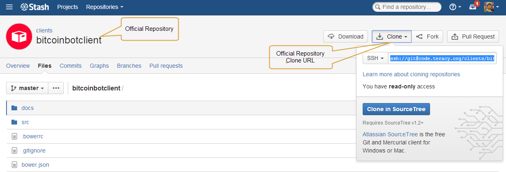

Workflow
========

At Teracy, we care about the workflow that makes it as much consistent and fun as possible, take
less time with higher quality of work.

We adopted `A successful Git branching model`_ for our development workflow with some specific
rules. What's the fun with a game without rules :-D?

First, Initialize Working Repositories
--------------------------------------

To start working on a repository project, ``fork`` it first to your git account.
Your working repositories MUST be cloned from your git account

.. and be stored under ``workspace/personal`` directory (or wherever you want, ``workspace/personal`` )

For example, you're going to work on ``https://code.teracy.org/projects/CLIENTS/repos/bitcoinbotclient/browse``
project

.. image:: _static/workflow/project.png

, so follow the following steps :

1. ``Fork`` the official repository to your developer account.

    **Step 1 :**

    .. image:: _static/workflow/fork-1.png

    **Step 2 :**

    .. image:: _static/workflow/fork-2.png
        :width: 500

    Fork successful, here is your result :

    .. image:: _static/workflow/fork-3.png

    And my repository's url is ``https://code.teracy.org/users/tucq/repos/bitcoinbotclient/browse``

2. ``Clone`` it to your workspace.
::

    $ git clone ssh://git@code.teracy.org/~tucq/bitcoinbotclient.git
                ============== "Forked" repo URL ===================

.. image:: _static/workflow/clone-fork-url.png

3. Add ``upstream`` repository (the official repository).
::

    $ git remote add upstream ssh://git@code.teracy.org/clients/bitcoinbotclient.git
                              ================= Official repo URL ==================

4. Re-check to verify your clone :
::

    $ git remote -v

.. image:: _static/workflow/git-remote-info.png

The successful start is when you have both this remotes on your local development :

    - ``origin`` (remote from your repo)
    - ``upstream`` (remote from official repo)

If yours is OK, it's time to switch to step 2: Git Branching Off

.. @TODO : Add remote for review other's works

Git Branching Off
-----------------

Usually, a new branch should be branched off from target to-be-merged remote branch.
It's often *upstream/develop* or sometimes *upstream/master*. However, there are cases that it does not apply:
Keep in mind that you need to rebase often the work of that upstream branch to your working branch.

Firstly, you must know what “Branching Off” meaning. In a shorthand, it’s mean you checkout from a branch,
then create another branch from that checkout.
::

    $ git checkout branch-1 -b branch-2

Here is how it works : Git starts checkout branch-1, then creates branch-2 based on that checkout.
Now branch-2 is on your local and ready for you to working on it.

Git is a distributed version control system, so collaboration like this should be encouraged.

Start working with Git
----------------------

-------------------------------
1. Workingflow in Teracy
-------------------------------

.. image:: _static/workflow/workflow-with-git.png

.. @TODO : Detail on making Pull-request
.. @TODO : Detail on making Resolve Conflict

The workingflow is summarized under 4 major steps :

- Step 1 : Branching-off based on your issue
- Step 2 : Code / Commit / Push
- Step 3 : Submit pull-request. Waiting for approve or resolve conflict if appears.
- Step 4 : Cleanning up branch

Let's get in more detais:

**Step 1 : Branching-off base on issue**

    If you don't know what is the meaning of "Branching-off", please check `Git Branching Off`_.

    Working on features
    ::
        $ git fetch upstream
        $ git checkout upstream/master -b features/<issue_key>-<concise_title>
        $ git push origin features/<issue_key>-<concise_title>

    Working on improvements
    ::
        $ git fetch upstream
        $ git checkout upstream/master -b improvements/<issue_key>-<concise_title>
        $ git push origin improvements/<issue_key>-<concise_title>

    Working on tasks or sub-tasks:
    ::
        $ git fetch upstream
        $ git checkout upstream/master -b tasks/<issue_key>-<concise_title>
        $ git push origin tasks/<issue_key>-<concise_title>

    Working on bugs
    ::
        $ git fetch upstream
        $ git checkout upstream/master -b bugs/<issue_key>-<concise_title>
        $ git push origin bugs/<issue_key>-<concise_title>

    Above are template `Branching off` based on issue's type.

**Step 2 : Developing with Code/ Commit/ Push**

    During your coding, you would make some commit and push, in that case you have to check TWO things:

        - `Quality Checklist`_
        - `Git Commit Messages`_

    If there're some changes from remote branch (could be *upstream/master*) that you need,
    you have to rebase your branch with that updates. It could be done by this :
    ::
        $ git fetch upstream
        $ git rebase upstream/master

    By doing this, your branch will be rebased with updates from others.
    If it has any conflict, you have to resolve them by:

    - Edit conflict file

           Sample on conflict file

           .. image:: _static/workflow/conflict-mark.png

           Sample on resolved-conflict file

           .. image:: _static/workflow/conflict-resolved.png

    - Add conflict-resolved-file in git then continue to rebase
      ::
           $ git add path/to/conflict-resolved-file
           $ git rebase --continue

**Step 3 : Submit Pull-request**

    When you get the issue completed, submit pull-request for reviewing on your work.
    There are TWO steps in submit pull-request:

    1. Send Code Pull-request

        .. image:: _static/workflow/submit-pull-request-code-1.png
        .. image:: _static/workflow/submit-pull-request-code-2.png

    2. Send Issue Pull-request

        .. image:: _static/workflow/submit-pull-request-issue.png

      Note: After a ``pull`` request, you will continue to work on your working branch as normal, just
      ``push`` it and the pull request will be updated with your new commits. Ping other Teracier to
      help reviewing, comments, suggestions, etc.

    When you meet all these long strict requirements, your work will be more welcomed accepted.

**Step 4 : Cleaning up branch**

    After your code get reviewed and approved. It will be merge to offical, so you have to make a
    `Git Branch Cleaning Up`_ to clean up your local and get ready for next issue.

-------------------------------
2. Git Rules
-------------------------------

To prevent chaos happening, we make some rules in the workflow and here are the details:

-----------------
Branch Name Rules
-----------------

When start working on a new issue, you always MUST to start a new branch for it and that branch's name
is based on type of the issue, which mean if the issue is :

- ``feature`` => Branch's name is ``features/<issue_key>-<concise_title>``
- ``improvement`` => Branch's name is ``improvements/<issue_key>-<concise_title>``
- ``task or sub-task`` => Branch's name is ``tasks/<issue_key>-<concise_title>``
- ``bug`` => Branch's name is ``bugs/<issue_key>-<concise_title>``
- ``critical bug`` => Branch's name is ``hot-fixes/<issue_key>-<concise_title>``

And more :

- ``<issue_key>`` is the "key" of the issues. It could be CLT-xxx, DEV-xxx .. blah ..blah. The key
  prefix is based on type of project.
- ``<concise_title>`` is issue's title which rewritten in concise way and replacing ``space`` with ``-``.
- ``<issue_key>`` and ``<concise_title>`` is seperated by a ``-`` character.

For example, with issue "CLT-183 | Sharing Tutorial is not firing email #652" .

It's <issue_key> could be "CLT-183" and it's <consie_title> is "sharing-tutorial-is-not-firing-email-#652"

-----------------
Quality Checklist
-----------------

Quality of work must be strictly defined with rules and measurements, especially with software
quality.

Any work is accepted as good enough MUST meet the following (including but not limited) requirements
of ``quality checklist``:

- no tab character
- length of the text/code line within 100 characters
- follow conventions and standards
- any tests must be done and must be passed
- any documentation must be updated
- the implementation must be good enough from the view of collaborators

We use many automatic tools to detect and reports the quality. Trust me, your work will be better
and better over time.

-------------------
Git Commit Messages
-------------------

Git commit message must convey the actual change/ work of that commit. Usually, the commit message
should follow the convention pattern:
::
    <issue_key> | <issue_title>: <changes description>

    <Multi-line description for detail changes, notices, solutions, etc.>

For example:
::
    DEV-1 | Auto deployment with Fabric

    Fabric deployment should be very easy to deploy on both local and remote machine.
    This is the work on local part.

----------------------
Git Branch Cleaning Up
----------------------

After your working branch is merged back into official repository, make sure to delete these
working branches.

Delete remote branch:
::
    $ git push origin :branch_name

Delete local branch:
::
    $ git checkout master
    $ git branch -d branch_name

--------------
Git Force Push
--------------

Should not ``$ git push origin branch_name -f`` if your branch has another branch depending on.

NEVER ever force push the *official* repositories.

----------------------------------------------
3. Official Repository's Merging and Releasing
----------------------------------------------

With branch merging and releasing workflow, *senior* collaborators must follow the git branching
model as mentioned by the article above.

As the merging, pushing must be done on official teracy's projects, so you need to push to
`upstream` repo.

For example, you need to merge the work of *features/1_auto_fabric_deployment* branch from
https://github.com/hoatle/django-boilerplate
::

    $ ws
    $ cd personal
    $ git clone git@github.com/hoatle/django-boilerplate.git 
    $ cd django-boilerplate
    $ git remote add upstream git@github.com/teracy-official/django-boilerplate.git
    $ git checkout develop
    $ git remote add phuonglm https://github.com/phuonglm/django-boilerplate.git
    $ git fetch phuonglm
    $ git git merge --no-ff phuonglm/features/1-auto-fabric-deployment
    $ git push upstream develop

Always `merge` with `--no-ff` to make sure we have the merging point to refer to later.

References
----------

- http://sethrobertson.github.io/GitBestPractices/
- http://www.reviewboard.org/docs/codebase/dev/git/clean-commits/
- http://tbaggery.com/2008/04/19/a-note-about-git-commit-messages.html

.. _`A successful Git branching model`: http://nvie.com/posts/a-successful-git-branching-model/
.. _`Branch name rule`: #branch-name-rule
